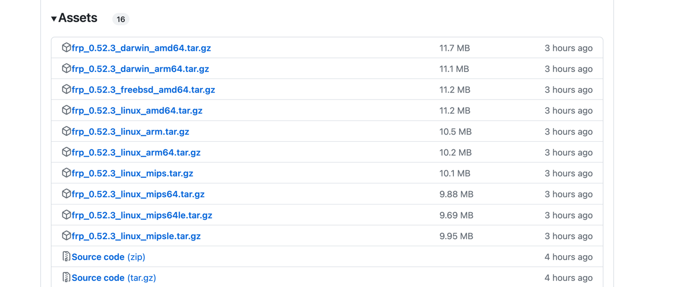
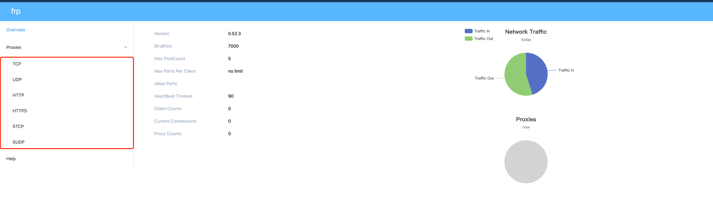
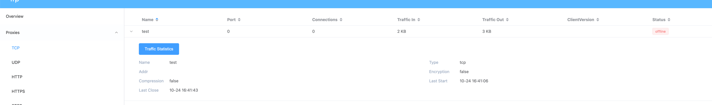

# 什么是frp？
[frp](https://github.com/fatedier/frp)是github上的一个开源项目，用于内网穿透，支持多种协议

# 什么是内网穿透？
不知道你有没有过疫情被封家里，然后还需要本地启动服务与同事联调的情况，简单说就是***通过内网穿透将你本地不可被公网访问的电脑映射出来***

# 下载解压，目录结构
访问[https://github.com/fatedier/frp/releases](https://github.com/fatedier/frp/releases)下载文件，***注意看好系统和架构选择文件下载***
如果你的服务器有安装 go语言则可以根据 ***go version*** 命令查看你匹配的文件
如果你跟我一样是centos X86_64架构，可以直接用这个，但github直连速度较慢，本地如果有代理推荐本地下载上传到服务器上
````
# wget https://github.com/fatedier/frp/releases/download/v0.52.3/frp_0.52.3_linux_amd64.tar.gz
````
 
下载好后直接解压
````
# tar -zxvf frp_0.52.3_linux_amd64.tar.gz 
````
移动到frp根目录下面可以看到

> ***frpc*** 客户端执行脚本 
> ***frpc.toml*** 客户端配置文件
> ***frps*** 服务端执行脚本
> ***frps.toml*** 服务端配置文件

# 服务端配置
配置端口、密码。如果你想要一个控制台来监控连接情况加入以下配置
````
bindPort = 7000 # 服务端端口
auth.token = "******" # 服务端密码
webServer.addr = "0.0.0.0" #默认127.0.0.1 不可以公网访问
webServer.port = 7500 # 控制台端口
webServer.user = "******" #控制台用户
webServer.password = "*****" #控制台密码

````
可以通过服务端执行脚本直接启动
````
# ./frps -c frps.toml 
2023/10/24 15:48:39 [I] [root.go:102] frps uses config file: frps.toml
2023/10/24 15:48:39 [I] [service.go:200] frps tcp listen on 0.0.0.0:7000
2023/10/24 15:48:39 [I] [service.go:312] Dashboard listen on 0.0.0.0:7500
2023/10/24 15:48:39 [I] [root.go:111] frps started successfully

````

但更推荐将服务端注册为服务，通过 **systemctl** 命令启停服务，并且可以设置开机自启
## 注册为服务
首先创建一个service文件
````
 vim /lib/systemd/system/frps.service
````
将以下内容写入文件中
````
[Unit]
# 服务名称，可自定义
Description = frps
After = network.target syslog.target
Wants = network.target

[Service]
Type = simple
# 启动frps的命令，需修改为您的frps的安装路径
ExecStart = /frp的根目录/frps -c /frp的根目录/frps.toml

[Install]
WantedBy = multi-user.target

````
控制服务的命令
````
# 查看服务状态
systemctl status frps.service
# 启动
systemctl start frps.service
# 停止
systemctl stop frps.service
# 重启
systemctl restart frps.service
# 设置开启自启
systemctl enable frps.service
systemctl daemon-reload
# 查看是否设置成功 enabled 则为成功 
systemctl is-enabled frps.service
````

## 客户端配置
服务端已经配置成功，现在开始安装服务端，实现内网穿透
比如你在你的本地电脑中跑了一个http服务
````
$python -m http.server 12345
Serving HTTP on :: port 12345 (http://[::]:12345/) ...
````
这相当于建立了一个文件共享服务，内网用户可以访问并下载目录下的文件

那么要怎样使得这个服务可以被公网访问呢？
同样的要下载一份frp文件，我这里是mac arm的架构，[文件链接](https://github.com/fatedier/frp/releases/download/v0.52.3/frp_0.52.3_darwin_arm64.tar.gz)
* frpc.toml
````
serverAddr = "你的服务端地址"                                                  
serverPort = 你的服务端端口
auth.token = "你的token"
 
[[proxies]]
#name 整个服务端唯一
name = "test" 
type = "tcp"
localIP = "127.0.0.1"
# 本地端口
localPort = 12345
# 映射到服务端的端口 
remotePort = 12345                     
````
启动则直接使用./frpc -c frpc.toml 即可。

## 服务端控制台
浏览器打开 http://serverAddr:serverPort/，通过认证即可进入

通过左边的协议类型，可以看到各种协议的客户端链接情况

